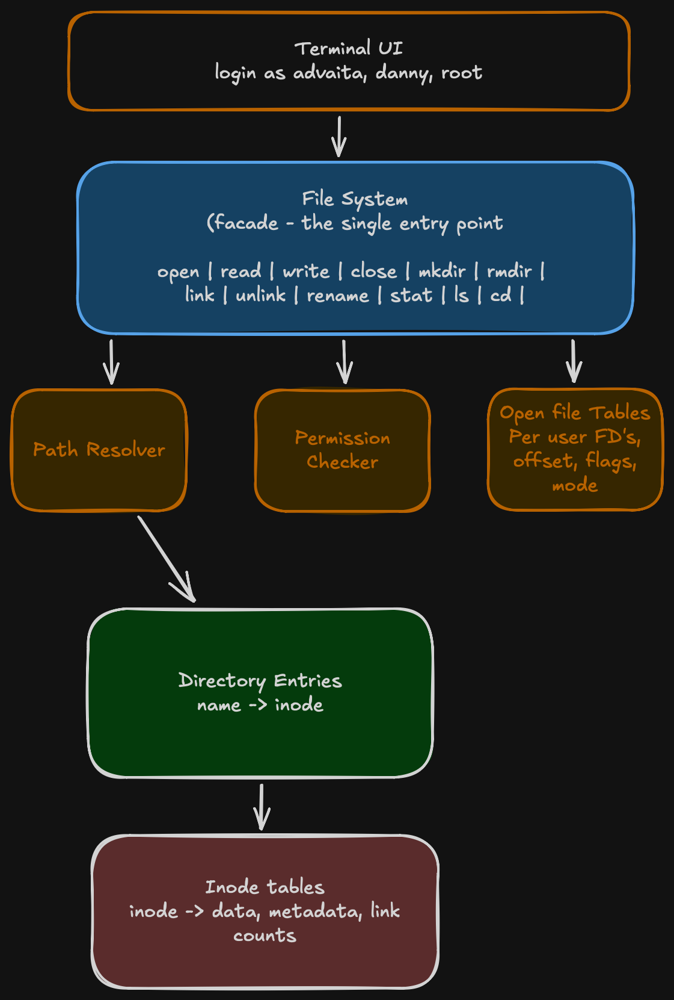

# inode-fs

**A POSIX-style in-memory filesystem, built from inodes up.**

## Objective
Building this filesystem grounds-up in Python, incrementally from first prnciples. Every design decision is documented, debated and explained.

## Architecture
<p align="center">
	
</p>

## Building in public

This project is being built incrementally, one design decision at a time.

## Tech Stack

- **Python 3.12+** - with strict type annotations
- **Poetry** - for dependency management
- **pytest** - for testing (every step ships with tests)
- **mypy** - for type checking (strict mode)
- **ruff** - for linting

## Getting Started
```bash
git clone https://github.com/thearun85/inode-fs.git

poetry install

make test
```

## Development
```bash
# Run ruff lint
make lint

# Run ruff format
make fmt

# Run mypy typecheck
make typecheck

# Run pytest
make test

# Run all
make all

# Tidy up the project
make clean
```

## License

[MIT](LICENSE)
